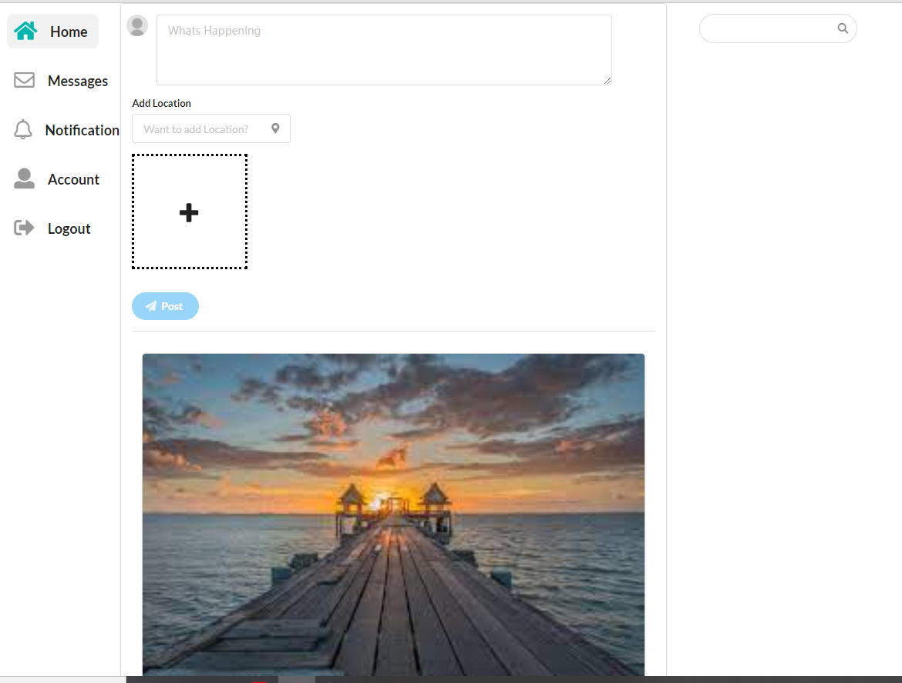
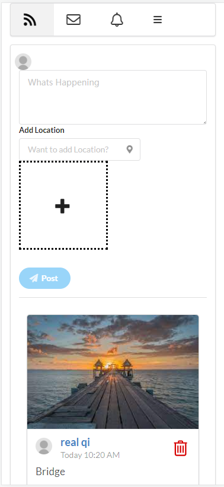
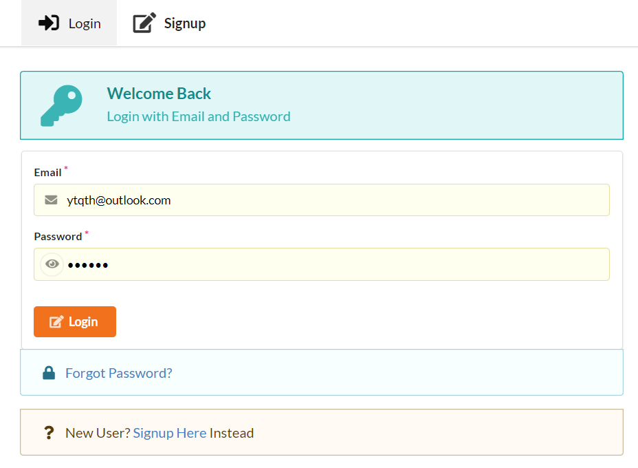
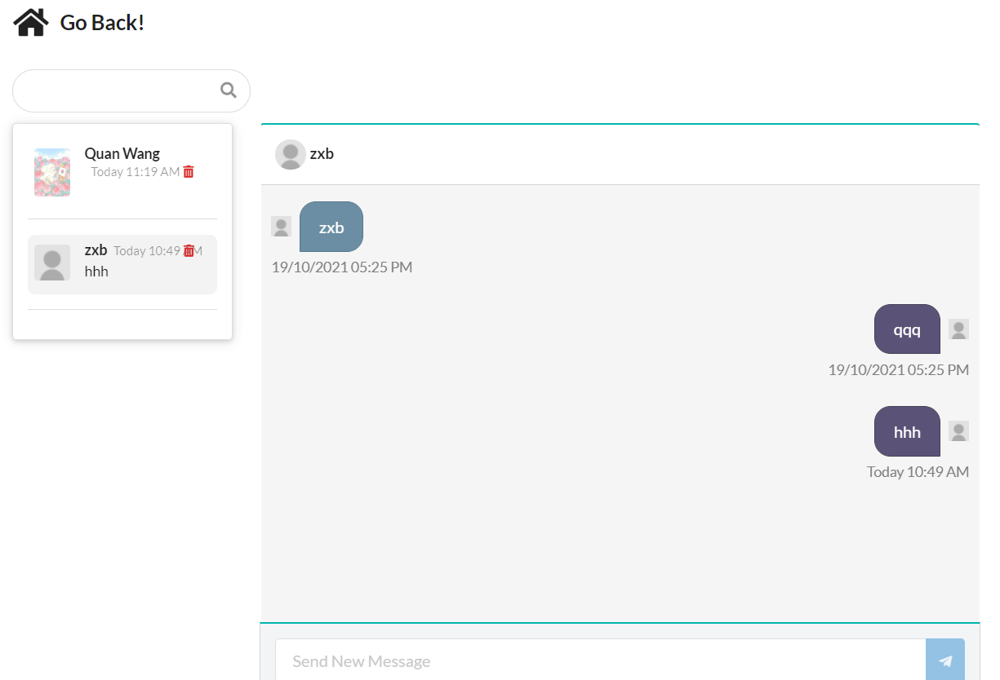
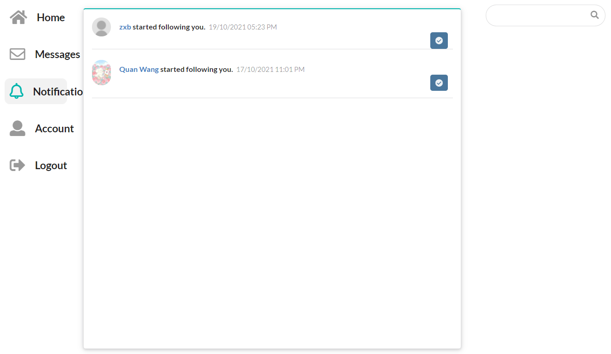
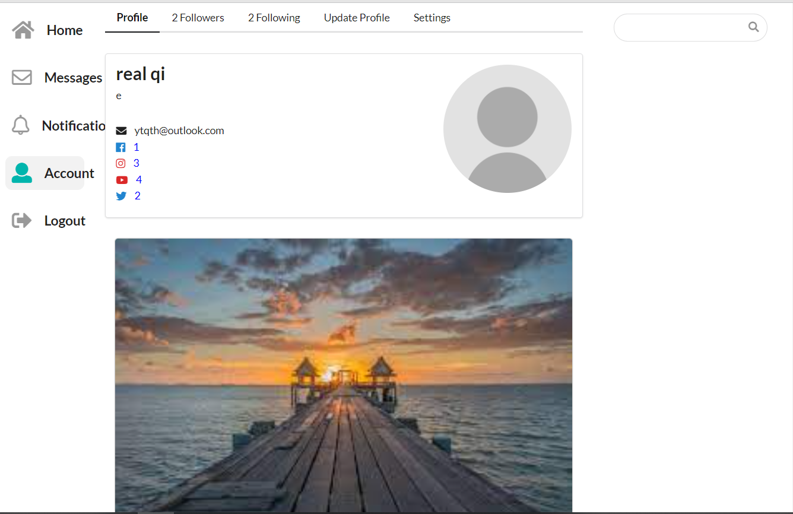

# social-media
 A MERN stack social media website with React, Express, Node.js, Nextjs, MongoDB, and Socket IO for real-time chat & Notifications.



---

## install & start

Add to your project with

```
yarn install
```

To start the project in development environment (local), run

```
yarn dev
```

To start the project in production environment, run

```
yarn start
```

To access the online demo https://inslike-socialmedia.herokuapp.com/

## features

mobile responsive layout



---

Login and signup page



---

real-time chats with multiple users and real-time notifications





---

account settings with check own profile, followers, following, notification and password settings




